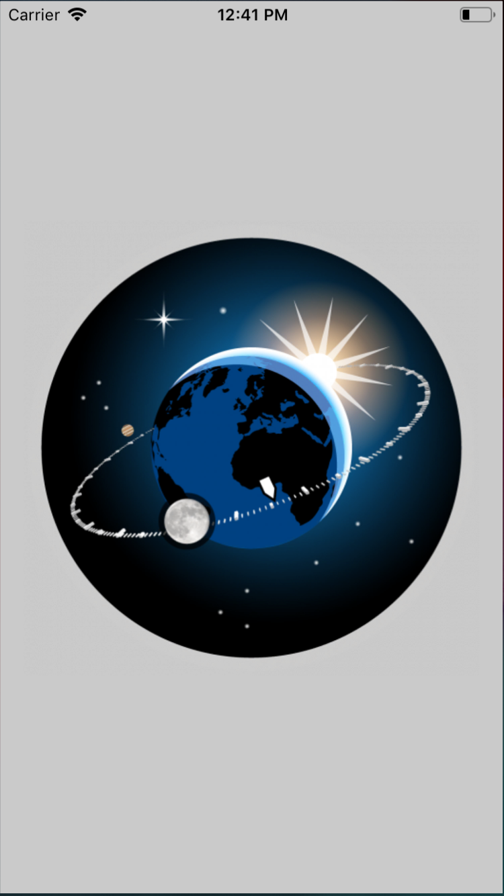
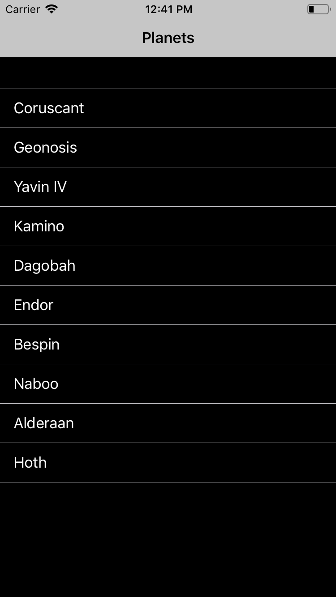

# Introduction 
This applicaiton support from iOS 11 and above. This is an Universal application.

Designed 1 screen
1. Planets : This screen displays list of planets

## Elements :
1. Planet Screen
    1. List of Planets by getting from API request![https://swapi.co/api/planets] and stroing in coredata for offline aupport as well.

## Model used:
Class Name `Planet` holds all the details of the Planet.

## For Coredata :
1. PlanetModule class maintains Coredata contexts, coordinators and data saving,fetching into Coredata.

## Networking:
1. APIManager maintains API requests and Callbacks.

## Output for the app

